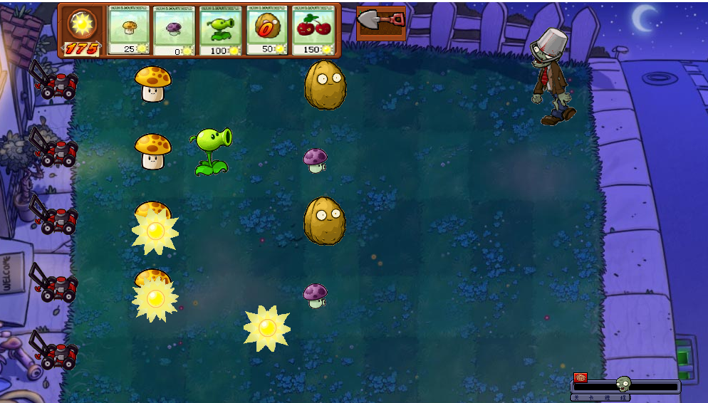

# 植物大战僵尸

## 游戏介绍

本游戏总共设计了三种模式：白天、黑夜、无尽模式 

* 对应于按钮中的冒险模式、迷你游戏、生存模式，其中冒险模
式属于闯关模式（即从白天到黑夜到生存模式）。 
* 进入游戏后开始选择植物： 

* 需要注意的是，如果白天种植黑夜的植物，植物会进入休眠状
态

* 选择好植物后点击 go 按钮正式进入游戏，否则点击重置
按钮重新选择植物，每位玩家的初始能量值为 50，玩家可通过
消耗收集到的阳光种植相应植物抵御僵尸的攻击，每种一个植
物，相应卡片进入恢复的倒计时过程中。 

* 游戏中给每位玩家提供了小推车、铲子、随机产生的阳光
及进度条四个个工具。小推车能铲除一行内的所有僵尸，铲子
能够铲除种错的植物，进度条控制游戏的进程。 
* 如果僵尸入侵玩家的房子，则游戏失败，游戏自动弹回开
始界面；如果抵御了所有的僵尸进攻，则获得游戏的胜利并且
进入下一关卡，重新选择植物。 
## 代码结构

